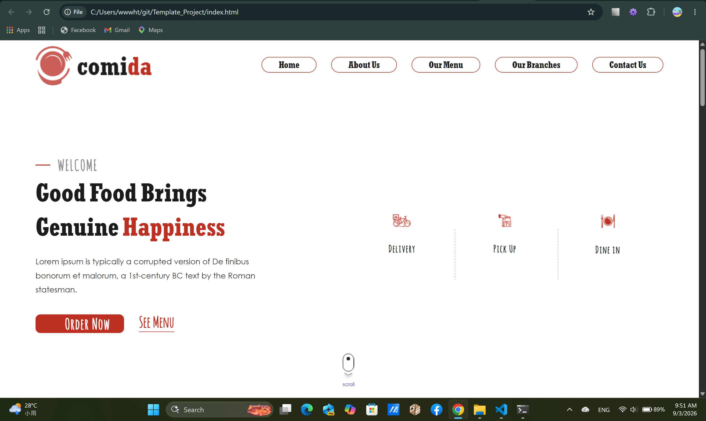
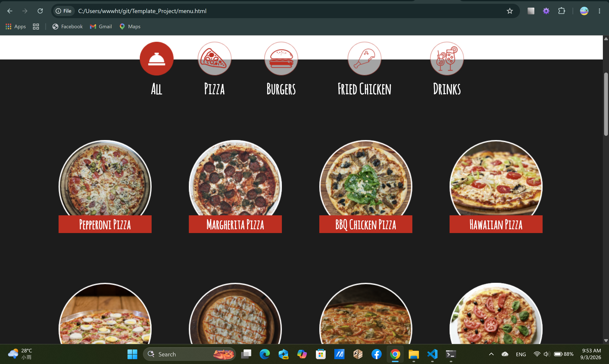
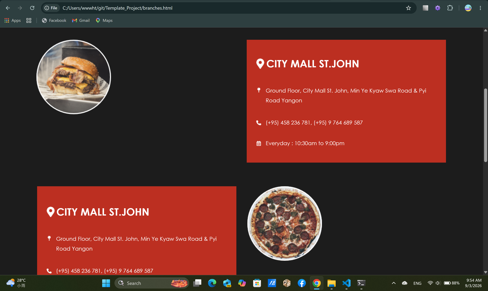
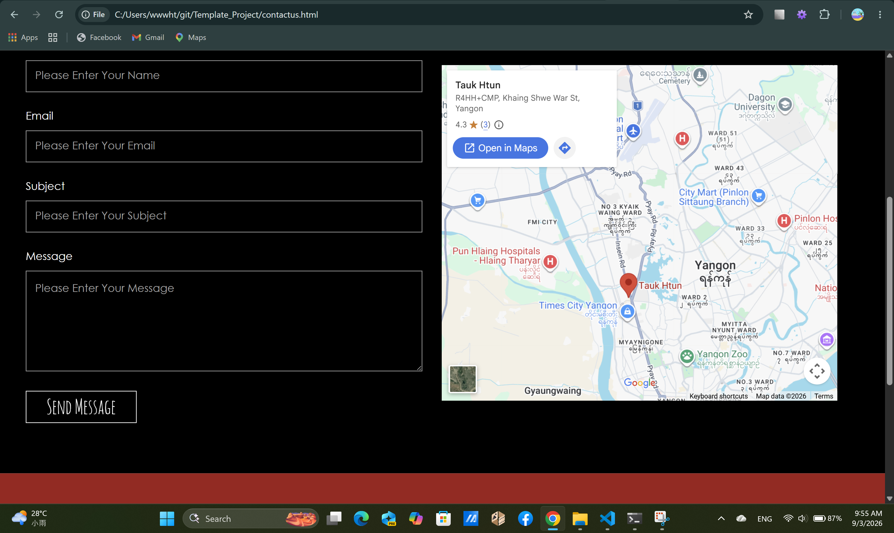

# Comida — Responsive Restaurant Website

A responsive restaurant website developed using HTML, CSS, and JavaScript.

## Overview

Comida is a multi-page restaurant website designed to provide a simple and user-friendly experience for customers.

The website supports desktop, tablet, and mobile screen sizes and includes restaurant information, menu browsing, branch information, and a contact page.

## Features

- Responsive design for desktop, tablet, and mobile
- Responsive navigation menu
- Restaurant menu browsing
- Menu detail page
- Image sliders
- Menu category navigation
- Restaurant branch information
- Contact page
- Interactive UI components

## Pages

- Home
- About Us
- Our Menu
- Menu Details
- Our Branches
- Contact Us

## Technologies

- HTML5
- CSS3
- JavaScript
- jQuery
- Slick Carousel

## What I Learned

Through this project, I practiced:

- Building multi-page websites with HTML
- Creating responsive layouts with CSS
- Using JavaScript for interactive features
- Implementing image sliders with Slick Carousel
- Organizing frontend project files
- Designing layouts for different screen sizes
- Managing a project using Git and GitHub

## Screenshots

### Home

### Menu

### Branches

### Contact

## Future Improvements

- Add an online ordering system
- Add customer authentication
- Connect the website to a backend API
- Add database integration
- Improve accessibility
- Deploy the website as a live web application

## Author

HTET OO WAI YAN